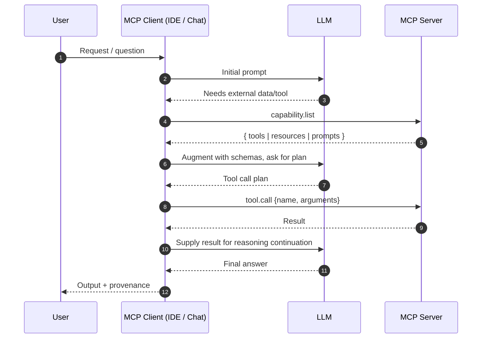

<a id="top"></a>

# MCP (Model Context Protocol) Workshop

> Updated for current codebase (Python + Node examples) – September 2025

## 1. What Is MCP (Quick Definition)
Model Context Protocol (MCP) is an open, transport‑agnostic protocol for discovering and invoking external capabilities (tools, resources, prompts) from AI clients (editors, chat assistants, agents). It standardizes:

* Capability discovery (`capability.list` / `capabilities.list` & friends)
* Structured invocation (`tool.call`, argument schemas, deterministic responses)
* Passive context surfacing (`resources.list` / `resources.read`, prompts registries)
* Separation of concerns (servers never see model internals unless explicitly passed)

Think of an MCP server as a capability adapter; the client (and its LLM) orchestrates which capabilities to call and when.

---

## 2. End‑to‑End Flow (Sequence)


Core conceptual methods:

| Domain | Methods (examples in this repo) |
| ------ | -------------------------------- |
| Tools | `capability.list` / `capabilities.list`, `tools.list`, `tool.call`, `tools.call` |
| Prompts | `prompts.list`, `prompts.get` (Python) / `prompts.build` (Node) |
| Resources | `resources.list`, `resources.read` |
| Lifecycle | `initialize`, `shutdown` (some servers) |

---

## 3. Capability Matrix (Actual Code vs Previous Docs)

| Server | Language | File | Capabilities Implemented | Notes |
| ------ | -------- | ---- | ------------------------- | ----- |
| simple-server (Python) | Python | `examples/simple-server/server.py` | `capability.list`, `tool.call (echo, add)` | Matches description. |
| simple-server (Node) | Node | `examples/simple-server/index.js` | `capability.list`, `tool.call (echo, add)` | Not previously documented in README. |
| prompts-server (Python) | Python | `examples/prompts-server/server.py` | `initialize`, `capability.list`, `prompts.list`, `prompts.get`, `shutdown` | README previously (incorrectly) claimed `prompts.build` and a tool; Python version does NOT implement them. |
| prompts-server (Node) | Node | `examples/prompts-server/index.js` | `capability.list`, `tool.call (markdown_summary)`, `prompts.list`, `prompts.build` | Node version supplies `markdown_summary` tool & `prompts.build`. |
| resources-server (Python) | Python | `examples/resources-server/server.py` | `initialize`, `capability.list`, `resources.list`, `resources.read`, `shutdown` | README matches (minor naming consistency). |
| tools-server (Python) | Python | `examples/tools-server/server.py` | `initialize`, `capabilities.list` (alias of `capability.list`), `tools.list`, `tools.call (echo, reverse)`, `shutdown` | New server previously undocumented. Provides both snake & camel input schema keys. |
| tools-server HTTP wrapper | Python (FastAPI) | `examples/tools-server/web_server_wrapper.py` | REST: `/health`, `/capabilities`, `/tools`, `POST /invoke`, `POST /tools/{name}` | Convenience HTTP façade. |
| Agent example | Python | `examples/agent_simple/agent_0.py` | LangGraph agent with `reverse_text` tool | Uses OpenAI-compatible model + LangChain/OpenAI packages. |

---

## 4. Repository Structure (Current)
```text
.
├── .env.example
├── README.md
├── requirements.txt
└── examples
    ├── agent_simple
    │   └── agent_0.py
    ├── simple-server
    │   ├── server.py
    │   └── index.js
    ├── prompts-server
    │   ├── server.py        (Python: prompts.get)
    │   └── index.js         (Node: prompts.build + markdown_summary tool)
    ├── resources-server
    │   ├── server.py
    │   └── resources/*.md
    └── tools-server
        ├── server.py        (echo, reverse)
        └── web_server_wrapper.py (FastAPI REST wrapper)
```

---

## 5. Setup

### 5.1 Python Environment
```bash
python -m venv .venv
source .venv/bin/activate
pip install -r requirements.txt
```

### 5.2 Node (per server folder)
Each Node server has its own `package.json`:
```bash
cd examples/simple-server && npm install
cd ../prompts-server && npm install
```

### 5.3 Environment Variables
Copy and edit:
```bash
cp .env.example .env
```
Variables of note:

| Name | Purpose | Required |
| ---- | ------- | -------- |
| `OPENAI_MODEL` | Default model name for agent example | No (default used) |
| `OPENAI_API_KEY` | API key for OpenAI-compatible endpoint | Yes for agent run |
| `RESOURCES_SERVER_DEBUG` | Verbose logging resources-server | No |
| `PROMPTS_SERVER_DEBUG` | Verbose logging prompts-server (Python) | No |
| `TOOLS_SERVER_DEBUG` | Verbose logging tools-server | No |

Load inline (Linux/macOS):
```bash
export $(grep -v '^#' .env | xargs)
```

---

## 6. Running the Example Servers

### 6.1 Python Simple Server
```bash
cd examples/simple-server
python server.py
```
Discover & call:
```bash
{ printf '{"jsonrpc":"2.0","id":1,"method":"capability.list"}\n'; } | python server.py
{ printf '{"jsonrpc":"2.0","id":2,"method":"tool.call","params":{"name":"add","arguments":{"a":2,"b":5}}}\n'; } | python server.py
```

### 6.2 Node Simple Server
```bash
cd examples/simple-server
node index.js
```

### 6.3 Python Prompts Server (prompts.get)
```bash
cd examples/prompts-server
python server.py
```
```bash
{ printf '{"jsonrpc":"2.0","id":1,"method":"capability.list"}\n'; } | python server.py
{ printf '{"jsonrpc":"2.0","id":2,"method":"prompts.list"}\n'; } | python server.py
{ printf '{"jsonrpc":"2.0","id":3,"method":"prompts.get","params":{"name":"summarize"}}\n'; } | python server.py
```

### 6.4 Node Prompts Server (prompts.build + tool)
```bash
cd examples/prompts-server
node index.js
```
```bash
{ printf '{"jsonrpc":"2.0","id":1,"method":"capability.list"}\n'; } | node index.js
{ printf '{"jsonrpc":"2.0","id":2,"method":"prompts.list"}\n'; } | node index.js
{ printf '{"jsonrpc":"2.0","id":3,"method":"prompts.build","params":{"name":"qa/basic","variables":{"question":"What is MCP?","context":"Protocol for tools"}}}\n'; } | node index.js
{ printf '{"jsonrpc":"2.0","id":4,"method":"tool.call","params":{"name":"markdown_summary","arguments":{"content":"# Title\nThis is some example markdown content for summarization."}}}\n'; } | node index.js
```

### 6.5 Resources Server
```bash
cd examples/resources-server
python server.py
```
```bash
{ printf '{"jsonrpc":"2.0","id":1,"method":"resources.list"}\n'; } | python server.py
{ printf '{"jsonrpc":"2.0","id":2,"method":"resources.read","params":{"name":"intro.md"}}\n'; } | python server.py
```

### 6.6 Tools Server (JSON-RPC)
```bash
cd examples/tools-server
python server.py
```
```bash
{ printf '{"jsonrpc":"2.0","id":1,"method":"capabilities.list"}\n'; } | python server.py
{ printf '{"jsonrpc":"2.0","id":2,"method":"tools.list"}\n'; } | python server.py
{ printf '{"jsonrpc":"2.0","id":3,"method":"tools.call","params":{"name":"reverse","arguments":{"text":"Model Context"}}}\n'; } | python server.py
```

### 6.7 Tools Server HTTP Wrapper
Run with FastAPI/uvicorn:
```bash
cd examples/tools-server
python web_server_wrapper.py   # or: uvicorn web_server_wrapper:app --reload
```
Endpoints:
* GET `/health`
* GET `/capabilities`
* GET `/tools`
* POST `/invoke` body: `{ "name": "echo", "arguments": { "text": "hi" } }`
* POST `/tools/{name}` body: `{ "arguments": { "text": "hi" } }`

---

## 7. Agent Example (`agent_simple/agent_0.py`)
Demonstrates a minimal LangGraph + LangChain agent with a single tool (`reverse_text`).

Run (after exporting env vars with `OPENAI_API_KEY`):
```bash
python examples/agent_simple/agent_0.py
```
Example prompt: “Reverse the string 'Model Context Protocol'. Then explain what you did.”

---

## 8. VS Code Integration (Conceptual)
Example user settings (paths must be absolute):
```jsonc
{
  "mcp.servers": {
    "py-simple": { "command": "python", "args": ["/abs/path/examples/simple-server/server.py"], "transport": "stdio" },
    "node-prompts": { "command": "node", "args": ["/abs/path/examples/prompts-server/index.js"], "transport": "stdio" },
    "tools": { "command": "python", "args": ["/abs/path/examples/tools-server/server.py"], "transport": "stdio" }
  }
}
```
Debug tips:
| Symptom | Likely Cause | Fix |
| ------- | ------------ | --- |
| No tools listed | Wrong path / permissions | Verify executable & shebang | 
| Hanging | Missing newline flush | Ensure each JSON message ends with `\n` |
| Schema mismatch | Arg key typo | Compare against server code |
| Parse error | Mixed logs on stdout | Send human logs to stderr |

Security: Only run trusted servers—they can execute code you invoke.

---

## 9. JSON-RPC Examples
```http
POST /rpc HTTP/1.1
Content-Type: application/json

{"jsonrpc":"2.0","method":"capability.list","id":1}
```
```bash
curl -X POST http://localhost:3000/rpc \
  -H "Content-Type: application/json" \
  -d '{"jsonrpc":"2.0","method":"capability.list","id":1}'
```
```javascript
const ws = new WebSocket('ws://localhost:3000');
ws.onopen = () => ws.send(JSON.stringify({jsonrpc:"2.0",method:"capability.list",id:1}));
```

---

## 10. Troubleshooting Quick Reference
* Parse errors: ensure each line is standalone JSON (no trailing commas)
* Nothing happens: add temporary stderr logs
* Windows piping: prefer WSL or ensure `\n` endings
* Large outputs: consider chunking (out of scope for workshop)
* Aliases: Some servers accept both `capability.list` and `capabilities.list`

---

## 11. Implementation vs Documentation Alignment
Discrepancies fixed in this README update:
1. Python `prompts-server/server.py` implements `prompts.get` (NOT `prompts.build`) and no tools.
2. Node `prompts-server/index.js` provides `prompts.build` and the `markdown_summary` tool (previous README implied Python did this).
3. Added previously undocumented `tools-server` (echo & reverse) + HTTP wrapper.
4. Added Node variant of simple-server (not referenced before).
5. Clarified alias usage (`capabilities.list` vs `capability.list`).
6. Added capability matrix for at-a-glance coverage.

No code changes were required for alignment; only documentation adjustments.

Potential future harmonization tasks:
* Add `prompts.build` to Python prompts server or rename method semantics.
* Generate JSON Schema for Node Zod-based tools (currently placeholder in simple server).
* Unify lifecycle (`initialize`/`shutdown`) across all servers.

---

## 12. Next Steps / Exercises
1. Add a new tool (e.g. `time.now` returning ISO timestamp)
2. Implement streaming partial outputs
3. Add `resources.search` with simple keyword match
4. Add cancellation (`cancel` method referencing `id`)
5. Port another server fully to TypeScript + proper schema emission
6. Integrate an actual LLM call inside a tool with token budgeting

---

## 13. Key Takeaways
* MCP separates capability exposure from reasoning & orchestration
* Declarative / inspectable schemas enable safer automated tool use
* Prompts and resources become first-class, composable context assets
* Transport neutrality future‑proofs integrations

---

## 14. Disclaimer
This workshop code is intentionally minimal: no version negotiation, advanced error taxonomy, authentication, multiplexing, or streaming events. For production use an official SDK and security best practices.

---

## 15. Environment Quick Start Recap
```bash
cp .env.example .env
python -m venv .venv && source .venv/bin/activate
pip install -r requirements.txt
export $(grep -v '^#' .env | xargs)
python examples/agent_simple/agent_0.py
```

---

Happy building! 🚀  |  [Back to Top](#top)